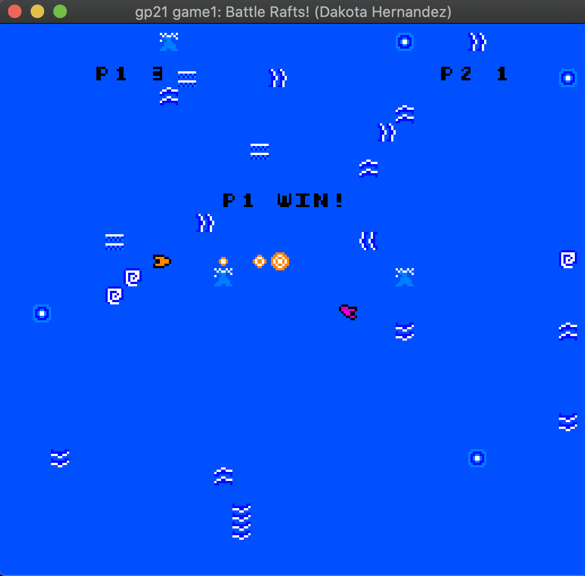

# Battle Rafts!

## Author: Dakota Hernandez (dshernan)

## Design:

The movement system is based on motor boats/rafts, and I am proud of the
game's movement system which (somewhat) accurately feels like you're driving on
water. The game is also player-versus-player, which offers more replayability.

## Screen Shot:

## Asset Formatting:

I am particularly proud of the extensibility of the asset system. One could
replace any of the asset files with a new set of assets (assuming they follow
the size constraints) and they *should* just work. The rules are a follows:

- The game's color palettes should be stored in
[dist/assets/palettes.png](dist/assets/palettes.png). The file should be a 4x8
`.png` file, where each row contains the four colors in a particular palette.
- The game requires four spritesheets, stored in
[dist/assets/spritesheets/](dist/assets/spritesheets/):
    - [player.png](dist/assets/spritesheets/player.png) should be an
    8 x (8 * 16) = 8 x 128 file containing the 16 sprites for the player.
    - [water.png](dist/assets/spritesheets/water.png) should be an
    8 x (8 * 8) = 8 x 64 file containing the 8 sprites for the water details.
    These decorative sprites are randomly inserted into the background.
    - [bullet.png](dist/assets/spritesheets/bullet.png) should also be an
    8 x (8 * 8) = 8 x 64 file. It contains the 8 sprites for the bullet
    animation.
    - [text.png](dist/assets/spritesheets/text.png) should also be an
    8 x (8 * 8) = 8 x 64 file. It contains the 8 text sprites used in the game.
- Sprites should be authored in greyscale. They will be converted to the colors
in a palette by dividing the color value by 85. That is,
    - (0, _, _, _) -> color 0 in the palette
    - (85, _, _, _) -> color 1 in the palette
    - (170, _, _, _) -> color 2 in the palette
    - (255, _, _, _) -> color 3 in the palette
    - Personally, I found it best to order the colors within my palettes by
    increasing brightness to match this system.

## How Your Asset Pipeline Works:

### New files:
- [asset_libs.hpp](asset_libs.hpp): Contains functions that read asset `.png`
files and compile them into binary files.
- [asset_libs.cpp](asset_libs.cpp): Implements functions defined in
`asset_libs.hpp`.
- [asset_converter_main.cpp](asset_converter_main.cpp): Uses `asset_libs` to
compile the assets into `.sprinfo` files. (I made up the `.sprinfo` format.)
Creates the [asset_converter](dist/asset_converter) binary to execute these
steps.

### Asset Pipeline:

What happens when you run `dist/asset_converter:`

1. Read `palettes.png` and write each color as a line of binary data (i.e. each
line contains 4 `char`s representing a single color that was read) to
`palettes.sprinfo`.
2. For each of `player.png`, `water.png`, `bullet.png`, `text.png`: Read the
image data and write each row of pixels as a line of `char`s to a `.sprinfo`
file, where each char holds the converted color value (i.e. the value in
{0,1,2,3} according to the process described in the Asset Formatting section).

Loading process in `dist/game` (specifically [PlayMode.cpp](PlayMode.cpp)):

1. There is only one set of 8 palettes, so just read the `char`s from
`palettes.sprinfo` and set every 4 lines to a color in a palette.
2. Every line in the other `.sprinfo` files contains 8 `char`s that each have a
value in {0,1,2,3}. Read each value and set the appropriate bit in the
`bit[0-1] uint8_t` number that corresponds to the correct pixel.
3. Tile map layout:
   1. Tiles 0-15 contain player sprites.
   2. Tiles 16-63 are reserved in case I made the player 16x16.
   3. Tiles 64-71 contain the background water details.
   4. Tiles 72-70 are reserved in case I add additional water details/animation.
   5. Tiles 80-87 contain bullet sprites/animation.
   6. Tiles 88-95 contain text sprites.
   7. Tiles 96-103 are reserved in case I add more text sprites.
   8. Tiles 104-254 are unused.
   9. Tile 255 is reserved for a fully transparent sprite.

## How To Play:

### Controls:

#### Player 1:

Player 1 is intended to be played using your **right** hand. 

- `w`: move forward
- `a`: rotate left
- `d`: rotate right
- `s`: brake
- `lshift`: shoot

#### Player 2:

Player 2 is intended to be played using your **left** hand.

- `i`: move forward
- `j`: rotate left
- `k`: rotate right
- `l`: brake
- `.`: shoot

### Objective:

## Other things I wanted but didn't have time for:

- Bigger players (16x16).
- Buoys floating around the water that block bullets and players -- players
would bounce off of them.
- More interesting map, with land/environment to direct movement/gunfights.
- Cooler animations and text.

This game was built with [NEST](NEST.md).

